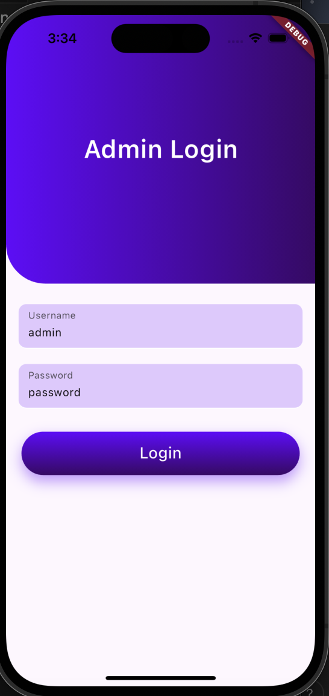
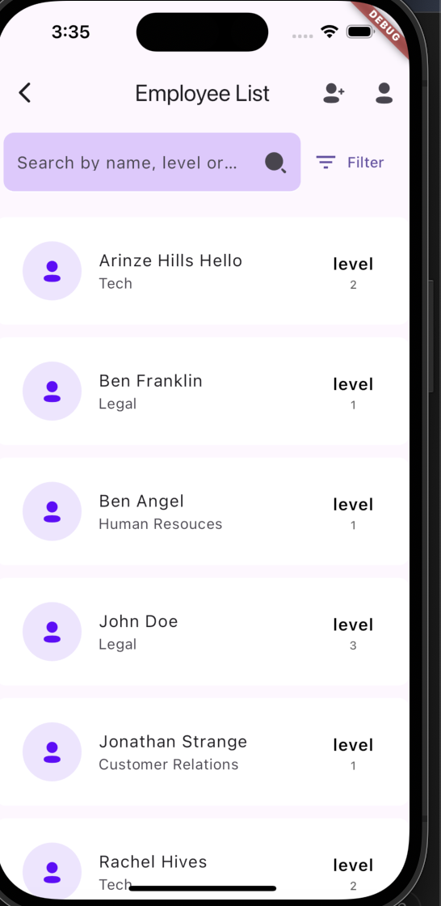
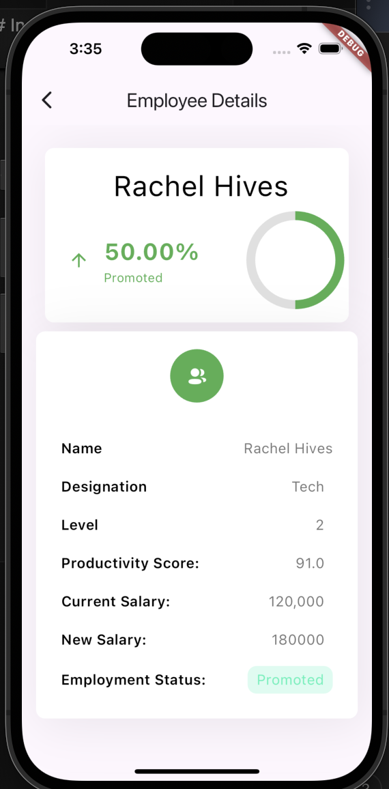
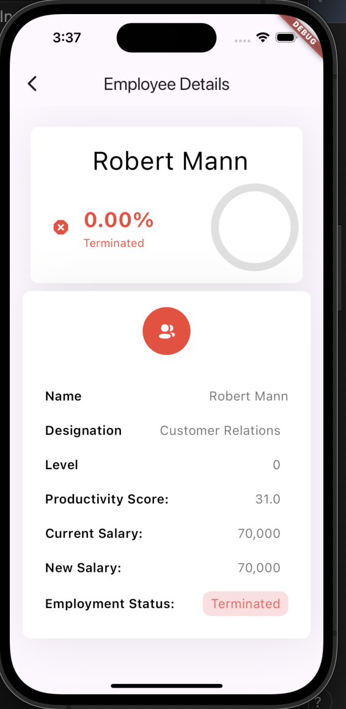
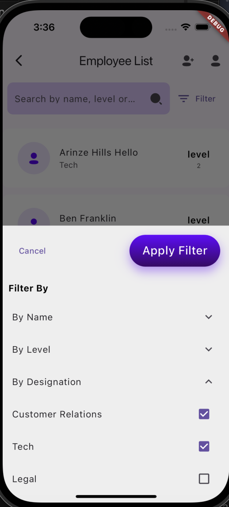

# mobile_assessment

Arinze Irecharge mobile app task - Employee Assessment System

## App Features

- Sign in as the admin of the company to view employees or add new one.(Please use "admin" as the username and "password" as password to sign in any other apart from this will fail)

    

- Displaying employees withing the company from a mock API then saving to local db(Hive).
  
- View detailed information about each employee and respective evaluated perfomance.
  
  
- Searching for employees by name, designation or level.
- Filtering Employees by one or more levels, one or more designation and name.
  

## Technologies Used

- **Flutter**: For building the user interface.
- **Provider**: For state management.
- **Hive**: For local data base(is an object storage db no need for sql queries, etc. and very fast and efficient for large data sets).
- **Shared Preferences**: For local storage (for storing user sessions).

## Getting Started - Project Setup

### Prerequisites

- Node.js (version 14 or higher)
- npm (or Yarn)

### Installation

1. Clone the repository:

   ```bash
   git clone https://github.com/arinzehills/Arinze-mobile-ass.git
   cd Arinze-mobile-ass
   pub get
   flutter run
   ```

2. Testing

   ```bash
   flutter test
   ```

## My Design Choice and Why

1. #### Modular(Feature) Driven Approach Following Clean Architecture:

- Clean Architecture follows the principle of clean code such SOLID and KISS principles
- Clean Architecture is a design pattern that separates the code into layers, each with distinct responsibilities. The main layers in your project are:

- Data Layer: Handles the retrieval of data from external sources (APIs, databases).
- Domain Layer: Contains business logic and use cases, independent of the data source.
- Presentation Layer: Manages the UI, usually with the help of ViewModels, and reacts to changes in the application state.

##### Benefits of Clean Architecture:

- Separation of Concerns:
- Testability:
- Flexibility: You can change or extend one layer (e.g., switch from Hive to SQLite) without affecting the others.
- Scalability:

2. #### State Management:

Provider: For It's Simplicity and ease of use i choose it for global state management to handle authentication and state management for my view models.
